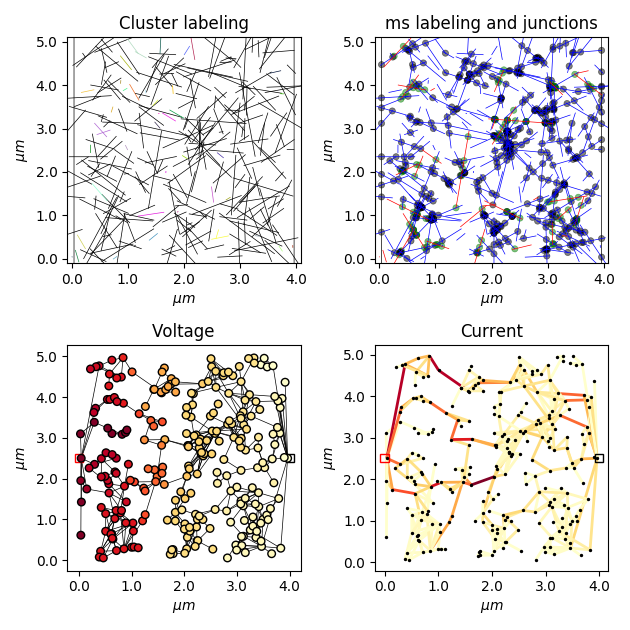

# Nanomaterial Network Simulator
## Overview
This project revolved around producing a simulation of the conduction through complex networks of carbon nanotubes (CNTs).

The code is written in Python 3.5.

The project is fully functioning, but will continue to evolve to meet research requirements.

This work is covered under the MIT open License. If you use or are inspired by this work, please be in touch!

## Example
with Python 3.5.x installed along with pip run:

    pip install -r requirements.txt

to install the necessary packages.

Running:

    python example.py

Should then produce plots of the network physically and a conduction map of the network as shown below:

This is a  5x5 um simulation for visual clarity showing the cluster identification (top left), the metallic(red) and semiconducting(blue) sticks (top right), and the resulting electrical network where nodes represent the voltage at a stick(bottom left) and edges represent conducting components generated from stick junctions(bottom right).

## code structure
The code has been designed to be easily modifiable for alternate nanomaterials and arrangements by breaking the code into the following sections:
- System Visualisation (`viewnet.py`), allows independant visualisation of the data structures, and is separated to facilitate lightweight code when visualisation is not necessary.
- Simulated Measurement (`measure_perc.py`). This module wraps the creation and data collection from a complete system, and has functions for allowing the measurement of large numbers of systems while varying the parameter space in order to make significant measurements. This is the script that handles multiprocessing of many measurements simultaneously to facilitate the analysis of large statistically significant samples of simulations.
- Physical network generation and analysis (`percolation.py`). This creates the network of nanomaterials and calculates the location and nature of intersections within the network.
- Electrical model (`network.py`). This generates an electrical system from the physical network, and solves for voltage and current within the system. The electrical components are populated from an arbitrary mapping, and can be readily changed.

## Some resources
### Modified Nodal Analysis (MNA)
The best and most comprehensive links for MNA on the web:
[MNA](https://www.swarthmore.edu/NatSci/echeeve1/Ref/mna/MNA2.html),
[Algorithm](https://www.swarthmore.edu/NatSci/echeeve1/Ref/mna/MNA3.html),
[Examples](https://www.swarthmore.edu/NatSci/echeeve1/Ref/mna/MNA4.html), and
[Matrix formation rules](https://www.swarthmore.edu/NatSci/echeeve1/Ref/mna/MNAMatrixRules.html).
